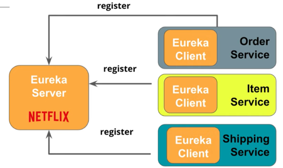
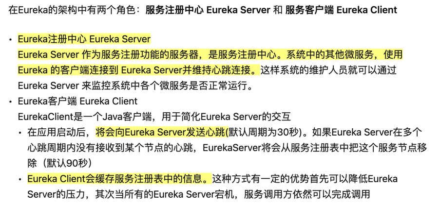

# Eureka start guide:

# Eureka Server: eureka(registry)
## Set up Server: 
1. Add dependencies: Config Client and Eureka Server on spring initializr
2. set[application.properties](./eureka/src/main/resources/application.properties):
   - set application name
   - set default port 8761
   - indicate that this is a server rather than client
   - set log level to see additional info
     - now use: {TRACE, DEBUG, INFO, WARN, ERROR, FATAL, OFF} instead of ON as the value
3. [EurekaApplication](./eureka/src/main/java/com/udacity/eureka/EurekaApplication.java): add annotation to notify that is a eureka server
4. http://localhost:8761/ to see eureka page

# Eureka Client service: dog microservice:
##  how does Spring Data Rest work?
1. At application startup, Spring Data Rest finds all of the **spring data repositories**
2. Then, Spring Data Rest **creates an endpoint** that matches the entity name
3. Next, Spring Data Rest **appends an S** to the entity name in the endpoint
4. Lastly, Spring Data Rest exposes CRUD (Create, Read, Update, and Delete) operations as RESTful APIs over HTTP
   
    
## spring data rest client
1. create entity: [Dog.java](./dogMicroservice/src/main/java/com/udacity/dogMicroservice/entity/Dog.java) @Entity, @Id (auto generation strategy)
2. Create a repository that extends CrudRepository.[DogRepository.java](./dogMicroservice/src/main/java/com/udacity/dogMicroservice/repository/DogRepository.java)
3. application.properties: [application.properties](./dogMicroservice/src/main/resources/application.properties)
  - H2 settings
  - spring.jpa.defer-datasource-initialization let hibernate create the table for us from data.sql
4. there is no controller layer, no need to address controller annotation
5. access: http://localhost:8082/dogs for dog details created by Spring Data Rest (append s)

## Registration
- Step 1: Turn the microservice into a Eureka client by adding the appropriate annotations and dependencies in the Maven POM file.
  1. [pom](./dogMicroservice/pom.xml):
    - add eureka client, cloud config, dependencies management
  2. [DogMicroserviceApplication](./dogMicroservice/src/main/java/com/udacity/dogMicroservice/DogMicroserviceApplication.java):
    - add annotation: @EnableEurekaClient to notify spring that it is a eureka client

- Step 2: Use a web browser to view the Eureka web console to ensure your microservice is registered.
  - after modification, access: http://localhost:8761/
  - an instance: DOG-MICROSERVICE appeared, which means new dog-service shown as registered with the Eureka server.

# Question：
1. what dependencies management do?
2. what:eureka.client.serviceUrl.defaultZone mean? why need two lines of this?
3. what eureka.instance.prefer-ip-address mean?

